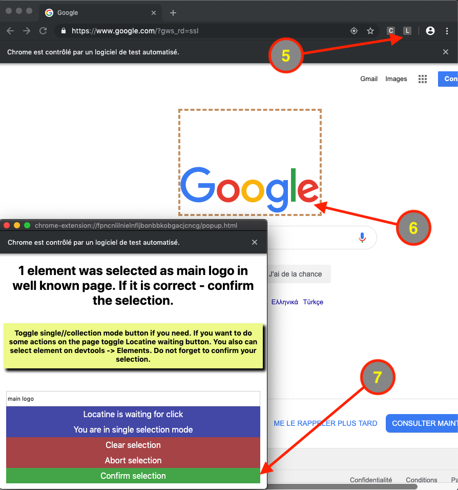

# Locatine

Element location tool based on Watir.

You are asking Locatine to find element for you.

It is asking you what element do you mean.

It is remembering your answer and collecting information about selected element.

After that it is finding element by itself.

If your element will be lost (due to id change for example) locatine will locate the most similar element.

That's it.

## Stage of development:

Version of Locatine is **0.02327** only. It means so far this is an alfa. You can use it in a real project if you are a risky person.

## Installation

Add this line to your application's Gemfile:

```ruby
gem 'locatine'
```

And then execute:

    $ bundle

Or install it yourself as:

    $ gem install locatine

## Usage

1. Be sure that you have [Chrome browser](https://www.google.com/chrome/browser/desktop/) installed. It should work with any browser but something you can do in Chrome only
2. Write the code

```ruby
require 'locatine'
s = Locatine::Search.new
s.browser.goto("yourpage.com.com")
s.find(name: "element", scope: "Main").click
```

3. Run it in terminal with parameter LEARN=1 approximately like:

    $ LEARN=1 ruby path_to_your_test.rb

4. It will open the browser and transfer you to the yourpage.com.com
5. Click Locatine application icon at the browser panel
6. Select element to represent *element* in the *Main* scope (you can click on it or select it in devtools)
7. And confirm the selection



8. Now you can run the test without LEARN parameter and it will work.

## Locatine app window

### Element name

You can ask the app to save element with any name. This name should be used for element finding later.

### Waiting for click

If you need to do some actions on page for debug purposes before defining the element you can turn off waiting for click. If Locatine is waiting for click every click is gonna be counted as element selection.

### Single\\Collection mode

If you need to find a collection of elements. Turn collection mode on. And click two elements of the kind. Locatine will automatically select all the elements that are similar to selected

### Clear selection

Click it to start element selection process from the very beginning.

### Abort selection

Will forcedly stop the selection process. Use with care since ruby methods will return nils and errors since element is not selected properly. Use it when you finish to define a scope.

### Confirm selection

When you've selected a correct element - confirm it in order to save.

## Locatine::Search options

```ruby
Locatine::Search.new(json: "./Locatine_files/default.json",
                     depth: 3,
                     browser: nil,
                     learn: ENV['LEARN'].nil? ? false : true,
                     stability_limit: 1000,
                     scope: "Default",
                     tolerance: 33,
                     visual_search: false,
                     no_fail: false)
```

### json

the file where data collected about elements will be stored

### depth

shows how many info will be stored about each element

- 0 = everything about the element
- 1 = everything about the element and the parent of it
- 2 = everything about the element and the parent of it + one more parent

### browser

if not provided new Watir::Browser will be started. Do not provide browser if you are going to use learn mode

### learn

mode is used to train locatine to search your elements. By default is false. But if you are starting your test like:

    $ LEARN=true ruby path_to_your_test.rb

it will turn learn to true by default.

### scope

is a setting that is representing default scope (group) where elements will be stored by default

### stability_limit

shows how much times attribute should be present to be considered a trusted one. The extremely large value means that locatine will hardly trust your code. Extremely low means that locatine will always believe that nothing in the code gonna be changed.

### tolerance

If stored metrics of element (including attributes, text, css values and tags) were changed Locatine will find and suggest the most similar one. Tolerance is showing how different in per cent new element may be to the old one. If 0 (zero tolerance) - locatine will find nothing if element lost. If 50 it is enough for element to have only half of parameters of old element we are looking for to be returned. If 100 - at least something is found - it goes. Default if 67 (means only 33% of element should stay in element to be found and returned).

### visual_search

locatine will count css values and position of element only if true. In that case locatine will not only read html code (attributes, tags, texts) but it will get css stylesheet for element, its position and size. In the most common case locatine is using attributes+tag+text to find the element. It is starting to use css styles of element and position only if element is lost in order to provide a better result and to mesure the similarity of the lost element and one that is found.

Position and size for element will be stored for the current resolution only. Start with new browser resolution will lead to deletion of all previous location\\size data.

Be careful! Set true only if appearance of your page is pretty stable.

### no_fail

When element is lost and no_fail is true you will get nil for single element and [] for collection. If no_fail is false (which is default) and locatine cannot find something you will face an error.

## Changing options on fly

You can get or set these values on fly. Like:

```ruby
s = Locatine::Search.new(learn: true)
s.learn #=> true
s.learn = false
```

## Locatine::Search find options

```ruby
s.find(name: "some name",
       scope: "Default",
       exact: false,
       locator: {},
       vars: {},
       look_in: nil,
       iframe: nil,
       return_locator: false,
       collection: false,
       tolerance: nil,
       no_fail: nil)
```
### name

should be always provided. Name of element to look for. Must be uniq one per scope. Ideally name should be made of 2-4 words separated by spaces describing its nature ("pay bill button", "search input", etc.) It will help Locatine to find them.

### scope

group of elements. Must be uniq per file. This is to help to store elements with same names from different pages in one file

### locator

you may provide your own locator to use. Same syntax as in Watir:

```ruby
find(name: "element with custom locator", locator: {xpath: "//custom"})
```

### vars

are used to pass dynamic attributes.

For example you have created an account on your site with

```ruby
name == "stablePart_qljcrt24jh"
```

where

```ruby
random_string == "qljcrt24jh"
```

was generated by random. Now you need to find the element with this part on the page. You can do

```ruby
random_string #=> "qljcrt24jh"
find(name: "account name", vars: {text: random_string})
```

Next time when your test will generate another random_string it will use new value.

```ruby
vars = {text: random_substring} # If you want the text of element to be dynamic
vars = {tag: random_tag} # The tag
vars = {attribute_name: random_attr} # If attribute is dynamic (use name of the attribute)
# And two lines work with visual_search == true only
vars = {css_option: random_value} # If your css is dynamic
vars = {x: random_x} # x, y, width, height for element size and position
```

And if you do not like it you can do:

```ruby
random_string #=> "qljcrt24jh"
find(name: "account name", locator:{text: "stablePart_#{random_string}")
```

### look_in

is for method name taken from Watir::Browser item. It should be a method that returns collection of elements like (text_fields, divs, links, etc.). If this option is stated locatine will look for your element only among elements of that kind. Be careful with it in a learn mode. If your look_in setting and real element are from different types. Locatine will be unable to find it.

### iframe

that is in order to find element inside of an iframe

### return_locator

true is returning the locator of the element instead of element. Use with care if attributes of your elements are dynamic and you are in a learning mode.

### collection

if true array of elements will be returned. If false only the one element (the first one found) will be returned.

### tolerance

You can state custom tolerance for the element.

### exact

It is disabling attempts to find element by advanced algorithms. If locator is provided find method will use only locator. If there is no locator only the basic search will be performed.

### no_fail

no_fail option that will work for that search only.

## Scope

If you want to define a whole bunch of elements at once you can do:

```ruby
search = Locatine::Search.new(learn: true)
search.get_scope(name: "Name of scope") # Will ask you about all the elements in scope
# or
scope = Locatine::Scope.new('Name of scope', search)
scope.define
```

You will be able to select all the elements and collections for scope one by one. When it is finished click "Abort Selection" button to exit the loop.

You can force use dynamic variables on define where is possible (same rules as for find):

```ruby
vars = {text: "dynamic text",
        tag: "span",
        attrName: "part of dynamic attr-value"}
scope.define(vars) # Will ask you about all the elements in scope
# Same
search.get_scope(name: "Name of scope", vars: vars) # Will ask you...
# Finally when scope is defined
search.find(scope: "Name of scope",
            name: "Name of element in scope",
            vars: vars # Necessary if elements were defined with vars)
```

### Methods of scope

If you want to get a hash with all elements that are defined in scope:

```ruby
# Lost elements will be found if possible!
search.get_scope(name: "Name of scope").all
# => {"element name": {
#      elements: Array of Watir::Element,
#      locator: valid xpath locator
#      },
#     "next element name":...
#    }
```

If you want to check presence of all elements:

```ruby
# Will raise an error if something lost!
search.get_scope(name: "Name of scope").check
```

## Other ways to use find

If the scope is set and you do not want to provide any additional options you can do:

```ruby
s = Locatine::Search.new
s.find("just name of element")
```

Also you can do:

```ruby
s = Locatine::Search.new
s.browser.button(s.lctr("name of the button"))
# or
s.browser.button(s.lctr(name: "name of the button", scope: "Some form"))
# or
s.browser.button(s.lctr("name of the button", scope: "Some form"))
```

That may be helpful in case of migration from plain watir to watir + locatine

If you want to find collection of elements you can use:

```ruby
s = Locatine::Search.new
s.collect("group of elements") # Will return an array
# or
s.collect(name: "group of elements")
```

Also:

```ruby
s.exact_collection(name: "something") == s.collect(exact: true, name: "something")
s.exact(name: "something") == s.find(name: "something", exact: true)
s.check(name: "something") == s.find(name: "something", tolerance: 0)
s.check_collection(name: "something") == s.collect(name: "something", tolerance: 0)
```
